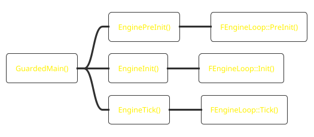
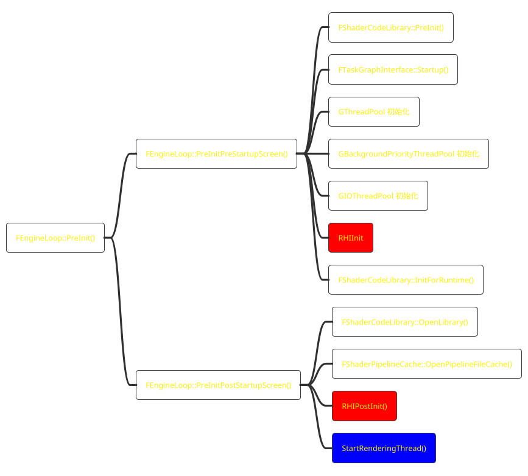
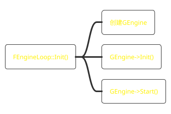
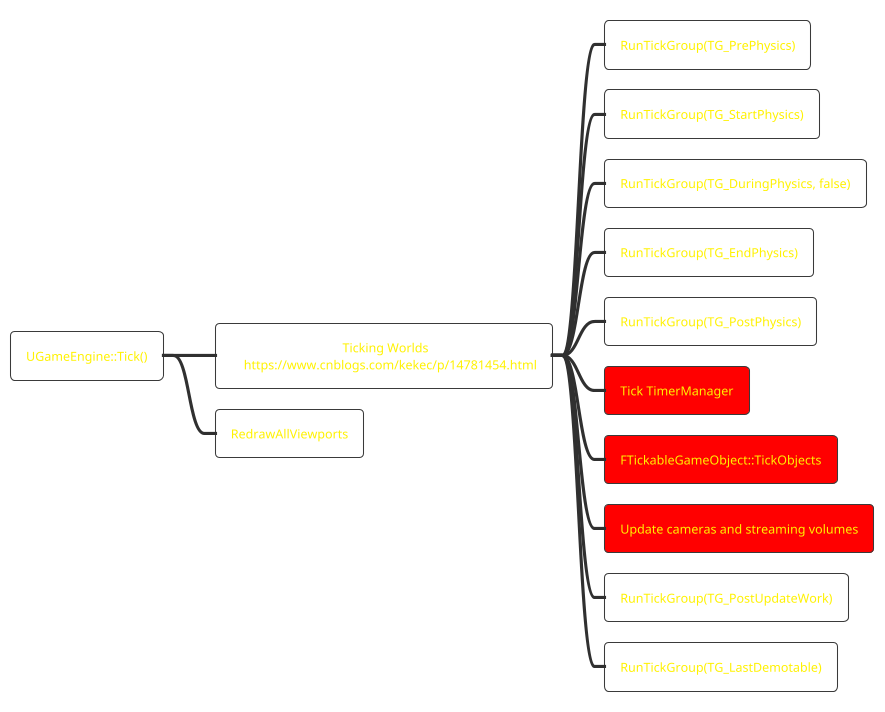

[toc]

# GuardedMain

# FEngineLoop::PreInit()


# FEngineLoop::Init()


# FEngineLoop::Tick
```puml
!theme black-knight

participant "GameThread" as GT
participant "RenderThread" as RT
'participant =RHIThread" as RHIT

'EnqueueRC
!procedure $enqueue_render_command($cmd, $desc)
GT-[#red]>RT:<b><font color=red>$cmd\n$desc
!endprocedure

RT->RT:FRenderingThreadTickHeartbeat\nTickRenderingTickables()

loop All world
$enqueue_render_command(UpdateScenePrimitives,"FScene::UpdateAllPrimitiveSceneInfo()")
end
$enqueue_render_command(BeginFrame,"BeginFrameRenderThread()")
loop All world
$enqueue_render_command(SceneStartFrame,"FScene::StartFrame()")
end
$enqueue_render_command(ResetDeferredUpdates, \
"handle some per-frame tasks on the rendering thread \n\
FDeferredUpdateResource::ResetNeedsUpdate()\n\
FlushPendingDeleteRHIResources_RenderThread()")

GT-[#yellow]>GT:GEngine->Tick()
GT-[#yellow]>GT:FSlateApplication::Tick()

$enqueue_render_command(WaitForOutstandingTasksOnly_for_DelaySceneRenderCompletion, \
"FRHICommandListExcutor::GetImmediateCommandList().ImmediateFlush()")

GT-[#yellow]>GT:RHITick()

GT-[#orange]>RT:FFrameEndSync::Sync()

$enqueue_render_command(EndFrame, "EndFrameRenderThread()")
```

## TickRenderingTickables()
## FScene::UpdateAllPrimitiveSceneInfo()
同步primitive添加删除和修改.
## UGameEngine::Tick()

## FFrameEndSync::Sync()
???

* [RenderDoc](https://docs.unrealengine.com/4.26/en-US/TestingAndOptimization/PerformanceAndProfiling/RenderDoc/)
* [Unreal Insight](https://docs.unrealengine.com/4.26/en-US/TestingAndOptimization/PerformanceAndProfiling/UnrealInsights/)